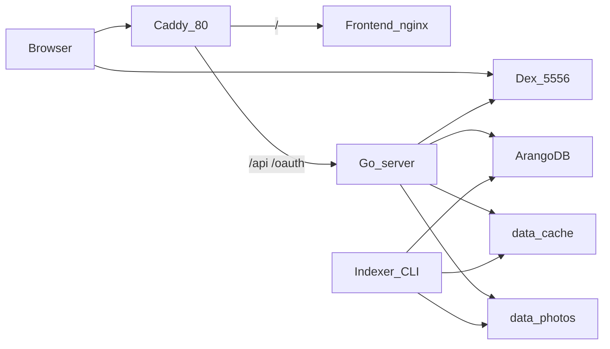

# Memries — Context Map

Stay in this repository. Do not read or edit parent directories.

## Decisions

| ADR | Decision |
|-----|----------|
| [0001](docs/adr/0001-agent-guidance-and-context-map.md) | AGENTS.md is the operating contract; CONTEXT-MAP.md is the persistent map; stay in this repo |
| [0002](docs/adr/0002-spa-owned-timeline-groups.md) | Memories buckets Photos in the SPA; ignore `/api/timeline` |
| [0003](docs/adr/0003-modular-monolith-compose.md) | Compose modular monolith (Go API, Arango, Dex, Caddy, React); not platform CDK |
| [0004](docs/adr/0004-owner-scoped-index-job-and-cursor-photos.md) | Browser-started owner-scoped Index run; composite-cursor `/api/photos` |
| [0005](docs/adr/0005-capture-time-stable-identity.md) | Capture clock, stable Photo `_key`, persisted owner library |
| [0006](docs/adr/0006-truncate-arango-for-resync.md) | Truncate Arango for resync; keep photo volumes |
| [0007](docs/adr/0007-viewport-forced-compact-thumbs.md) | Compact grids: 256 at viewport ≥1280px, else 512; no `srcset` |
| [0008](docs/adr/0008-smart-date-search.md) | Search smart dates are SPA-parsed; `/api/photos` gets `month` / `local_from` / `local_to`; Filter opens Search |
| [0009](docs/adr/0009-e2e-docker-skill-owns-isolated-stacks.md) | `/e2e-docker` lives here: one feature file, one Compose project, last-runs in this repo |

## Contexts

| Context | Path | Start here |
|---------|------|------------|
| Photo library / API | [backend/](backend/), [CONTEXT.md](CONTEXT.md) | [cmd/server/main.go](backend/cmd/server/main.go), [internal/api/api.go](backend/internal/api/api.go), [internal/db/models.go](backend/internal/db/models.go) |
| Indexer | [backend/cmd/indexer](backend/cmd/indexer/main.go), [internal/index](backend/internal/index/indexer.go) | HTTP job or CLI walks prefix → identity → EXIF → thumbs → upsert ([0004](docs/adr/0004-owner-scoped-index-job-and-cursor-photos.md)) |
| Timeline UI | [frontend/src](frontend/src) | [App.tsx](frontend/src/App.tsx) → [Timeline.tsx](frontend/src/components/Timeline.tsx) → [groupPhotos.ts](frontend/src/lib/groupPhotos.ts); catalog in [lib/api.ts](frontend/src/lib/api.ts) |
| Local ops | [docker-compose.yml](docker-compose.yml), [deploy/](deploy/), [Makefile](Makefile) | Caddy routes; Dex issuer `http://localhost:5556`; catalog reset [docs/adr/0006-truncate-arango-for-resync.md](docs/adr/0006-truncate-arango-for-resync.md) |
| Isolated Playwright BDD | [e2e/](e2e/) | One feature per Compose project ([0009](docs/adr/0009-e2e-docker-skill-owns-isolated-stacks.md)); skill [`.cursor/skills/e2e-docker/`](.cursor/skills/e2e-docker/) |



## Glossary

- **Photo** — Arango `photos` doc; `_key` is stable identity (path-first on Sync); `hash` is sha256 of current bytes; `kind` is `photo` today (video reserved). See [docs/adr/0005-capture-time-stable-identity.md](docs/adr/0005-capture-time-stable-identity.md).
- **Owner** — `users` doc keyed by sha1(lowercase email); photos filter `owner_id`.
- **TakenAt** — EXIF `DateTimeOriginal` (then digitized / `DateTime`), else filesystem birth, else mtime; UI buckets on `taken_at_local` ([0005](docs/adr/0005-capture-time-stable-identity.md)).
- **Granularity** — `year` / `month` / `week` / `day`; week is ISO year-week in AQL. Memories buckets in the SPA, not `/api/timeline` ([docs/adr/0002-spa-owned-timeline-groups.md](docs/adr/0002-spa-owned-timeline-groups.md)).
- **Storage** — interface; `local` implemented; `s3` factory returns “phase 3”.
- **Thumb** — JPEG cache under `MEMRIES_CACHE_ROOT`, paths `ab/<hash>/256.jpg` etc. Compact grids use 256 when the viewport is ≥1280px, else 512 ([docs/adr/0007-viewport-forced-compact-thumbs.md](docs/adr/0007-viewport-forced-compact-thumbs.md)).
- **Album** — named owner-scoped set of Photos (`albums` + `in_album`). Domain language: [CONTEXT.md](CONTEXT.md).
- **Index run** — persisted owner-scoped job; HTTP always scans `data/photos/<email>` ([docs/adr/0004-owner-scoped-index-job-and-cursor-photos.md](docs/adr/0004-owner-scoped-index-job-and-cursor-photos.md)).
- **Session** — cookie `memries`, 30 days, HttpOnly, Lax.

Owner ACL today: session user key vs `photo.owner_id` / `album.owner_id`. Share edges (`owns`, `shared_with`, `album_shared`) are schema only.

## HTTP (Caddy `:80`)

- `/` → frontend
- `/oauth/login`, `/oauth/callback`, `/oauth/logout` → backend (unauthenticated handlers)
- `/api/*` → backend + auth middleware: `GET /me`, `/timeline`, `/photos` (`year`, `month`, `local_from`, `local_to`, `favorite`, `q`), `/photos/{id}`, `/photos/{id}/favorite`, `/albums`, `/albums/{id}`, `/albums/{id}/photos`, `/thumb/{id}`, `/original/{id}`, `/index`, `/index/status`
- `/healthz` on the backend only (not via Caddy today)

## Module map (backend `internal/`)

- `config` — `MEMRIES_*` env
- `auth` — Dex OIDC + cookie + `/api/me`
- `db` — connect, schema, users, photos/timeline AQL
- `storage` — `Storage` + `local.go`
- `exif` / `thumb` / `index` — indexer pipeline
- `api` — JSON + byte streaming

## Frontend

- Cookie `credentials: "include"`; 401 → `/oauth/login`
- Splash polls `/api/index/status` and may `POST /api/index` ([0004](docs/adr/0004-owner-scoped-index-job-and-cursor-photos.md))
- Memories pages `/api/photos` and groups in the SPA; `/api/timeline` is unused by the UI ([docs/adr/0002-spa-owned-timeline-groups.md](docs/adr/0002-spa-owned-timeline-groups.md))
- Granularity is React state (not `localStorage`); theme is the only persisted UI key

## Photo layout

The HTTP **Index run** always walks the session email prefix; the CLI may pass another `-prefix`. Recommended:

```
data/photos/<owner-email>/<yyyy>/<mm>/<file>.jpg
```

Accepted media extensions: `.jpg`, `.jpeg`, `.png`, `.webp`, `.gif`.

## Arango collections

Document: `photos`, `users`, `albums`, `index_runs`.

Edges: `in_album` (Album membership). Schema only: `owns`, `shared_with`, `album_shared`.

Indexes: persistent `taken_at`, `(owner_id, taken_at)`, unique `hash`, unique `email`.

## Known constraints (do not “fix” unless asked)

- Dex listens on host `:5556` (not behind Caddy) so the backend can discover OIDC at boot; backend uses `extra_hosts: localhost:host-gateway`.
- Arango root password is set on first init only. Empty the catalog with `make db-clear` ([docs/adr/0006-truncate-arango-for-resync.md](docs/adr/0006-truncate-arango-for-resync.md)); wipe volumes only when the password itself is wrong.
- Dev login in [deploy/dex/config.yaml](deploy/dex/config.yaml): `admin@example.com` / `password`.
- Share edges (`owns`, `shared_with`, `album_shared`) exist in schema only.
