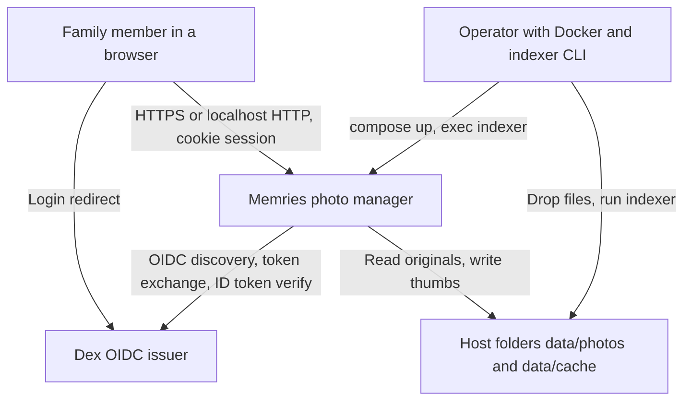
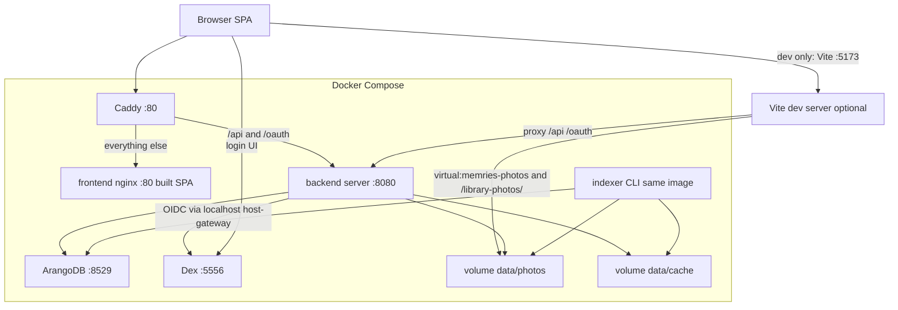
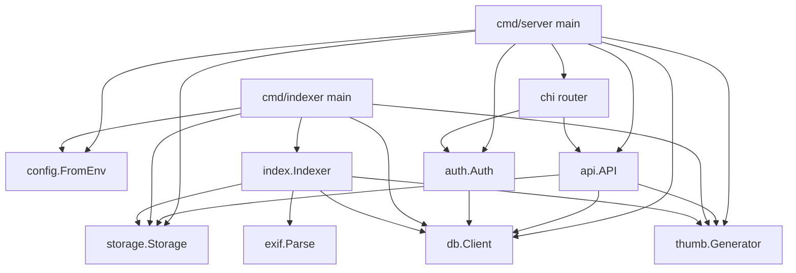
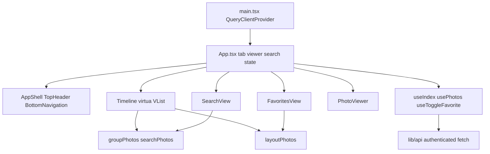
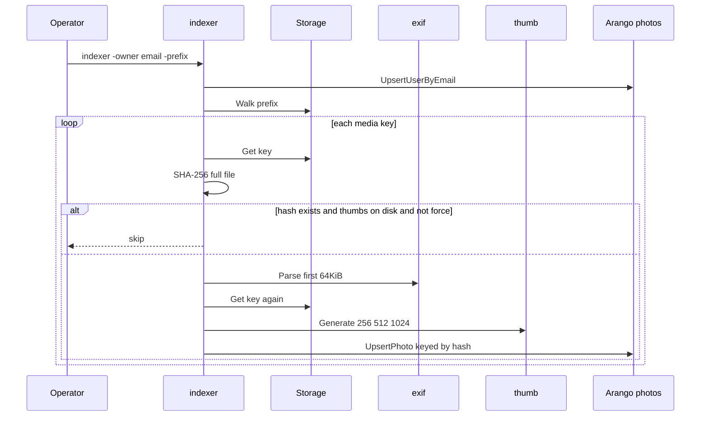
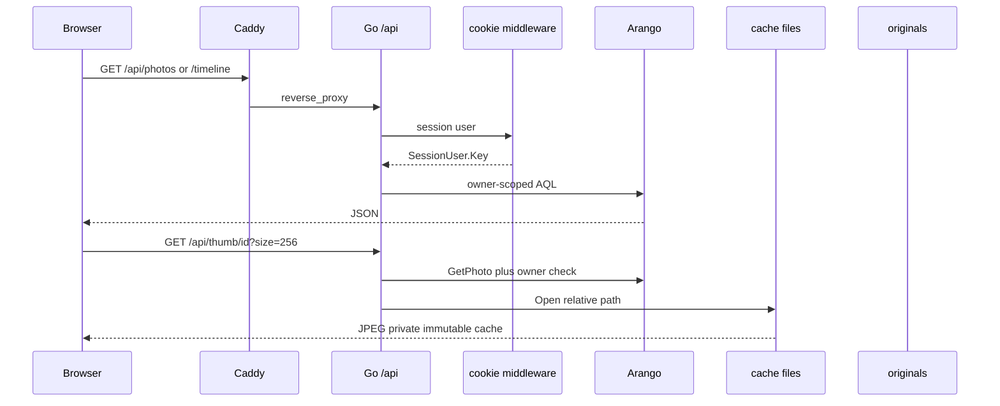

# Project Architecture Blueprint — Memries

Generated: 2026-08-25; refreshed 2026-08-25 after wiring the SPA to the Go indexer and paginated photos API (`apps/memries`, remote [mikepattyn/memries](https://github.com/mikepattyn/memries)).

This is the architecture reference for keeping new work consistent with what the code actually does. Prefer this file over README sketches when they disagree.

**Detected stacks:** Go 1.23 HTTP API (chi) · ArangoDB 3.12 · React 18 + Vite 5 + Tailwind 3 · OIDC (Dex) · Caddy 2 reverse proxy · Docker Compose.

**Detected patterns:** Modular monolith with a plugin storage port; document/graph database with ACL filters in AQL; React composition with a Query cache over authenticated `/api` pages. Not Clean Architecture, not microservices, not platform CDK.

**Platform context:** Memries is a gitlink (`update = none`), not a mikepattyn Application. It does not use `infra/cdk/`. Start here; the umbrella map is [CONTEXT-MAP.md](../../../CONTEXT-MAP.md) in the parent repo. `apps/memries/CONTEXT.md` is referenced there but is not present in this tree.

---

## Table of contents

1. [Architecture detection and analysis](#1-architecture-detection-and-analysis)
2. [Architectural overview](#2-architectural-overview)
3. [Architecture visualization](#3-architecture-visualization)
4. [Core architectural components](#4-core-architectural-components)
5. [Architectural layers and dependencies](#5-architectural-layers-and-dependencies)
6. [Data architecture](#6-data-architecture)
7. [Cross-cutting concerns](#7-cross-cutting-concerns)
8. [Service communication](#8-service-communication)
9. [Technology-specific patterns](#9-technology-specific-patterns)
10. [Implementation patterns](#10-implementation-patterns)
11. [Testing architecture](#11-testing-architecture)
12. [Deployment architecture](#12-deployment-architecture)
13. [Extension and evolution](#13-extension-and-evolution)
14. [Architectural pattern examples](#14-architectural-pattern-examples)
15. [Architectural decision records](#15-architectural-decision-records)
16. [Architecture governance](#16-architecture-governance)
17. [Blueprint for new development](#17-blueprint-for-new-development)

---

## 1. Architecture detection and analysis

### Technology inventory

| Area | Evidence | Choice |
|------|----------|--------|
| API process | `backend/cmd/server/main.go`, `go.mod` | Go 1.23, chi v5, slog |
| Indexer process | `backend/cmd/indexer/main.go`, `internal/index` | CLI plus authenticated HTTP job on the server |
| Persistence | `backend/internal/db/*`, compose `arangodb:3.12` | ArangoDB document + edge collections |
| Object storage | `backend/internal/storage` | `Storage` interface; `local` only; `s3` returns “coming in phase 3” |
| Identity | `backend/internal/auth`, `deploy/dex/config.yaml` | OIDC Authorization Code + cookie session |
| UI | `frontend/package.json`, `frontend/src/*` | React 18 SPA, Vite, Tailwind, TanStack Query, virtua |
| Edge | `deploy/caddy/Caddyfile`, `docker-compose.yml` | Caddy `:80` → backend `/api`+`/oauth`, else frontend |
| Images | `GET /api/thumb/{id}`, `GET /api/original/{id}` | Session cookie; thumbs from cache, originals from Storage |
| Hosting | Dockerfiles + Compose | Local Compose; no K8s, no CDK |

### Architectural pattern (as implemented)

Memries is a **modular monolith** split into two runtimes that share a Go module:

1. **HTTP server** — config → storage + Arango + thumbs + OIDC + index coordinator → chi router.
2. **Indexer CLI** — same package as the HTTP job; walks storage, hashes, EXIF, thumbs, upserts photos.

The frontend is a **single-page composition** (no router library). Tabs are React state (`memories` / `favorites` / `search`).

The SPA loads photos from authenticated `/api/photos` pages. After login it reads `/api/index/status` and `POST`s `/api/index` when the owner has never completed an import. The CLI remains an idempotent fallback. Albums stay in an in-memory store until a later persistence task.

### Folder conventions

```
backend/
  cmd/server          HTTP composition root
  cmd/indexer         batch composition root
  internal/
    config            env → Config
    api               chi handlers (timeline, photos, index, media)
    auth              OIDC + cookie session + /api middleware
    db                Arango client, schema, queries, models
    storage           Storage port + local adapter + factory
    index             walk/hash/EXIF/thumb/upsert pipeline + job coordinator
    exif              EXIF → db.EXIF
    thumb             256/512/1024 JPEG cache
frontend/
  src/
    components        shell, timeline, search, viewer, indexing splash
    hooks             infinite photos query + index status
    lib               API client, grouping, layout, dates, albums store
    models            Photo / Granularity / SearchState
deploy/caddy, deploy/dex
data/photos, data/cache     bind-mounted (gitignored)
```

Go `internal/` is the enforcement of “not a public library.” There are no Go interfaces for db or auth; only `storage.Storage` is a true port.

---

## 2. Architectural overview

### Approach

Self-hosted family photo manager meant to replace Piwigo. The product idea is **date-scroll browsing with year/month/week/day granularity**, not albums-as-the-primary-UX.

Guiding principles visible in the code:

- **Owner isolation at query time.** Timeline and list AQL always `FILTER p.owner_id == @uid` and `deleted_at == null`. Single-photo and media routes compare `p.OwnerID != u.Key`.
- **Content-addressed photos.** `_key` and `hash` are SHA-256 of file bytes. Dedup is by hash, not path.
- **Storage is a port.** Originals are never assumed to live next to the API binary; `StoragePtr` records backend + path (bucket reserved for S3).
- **Thumbs are derived cache.** Three JPEG sizes under `MEMRIES_CACHE_ROOT`, keyed by hash prefix, not by original path.
- **Capture time is a first-class sort key.** Backend `taken_at`; frontend `takenAt` as a timezone-naive wall clock (see ADR-M4).
- **Auth at the edge of `/api`.** Cookie session after Dex; `/healthz` and `/oauth/*` stay public on the backend process.
- **UI stays simple.** No React Router, no global store, no CSS-in-JS. Shell + three views + lightbox.

### Boundaries

| Boundary | How it is enforced |
|----------|--------------------|
| Process | Two binaries; HTTP server also runs the indexer package in-process |
| HTTP API vs UI | Caddy path split; Vite proxy in dev |
| Authn | chi middleware on `/api`; handlers still check context user |
| Authz | owner_id on every photo read |
| Storage keys | `Local.resolve` rejects path escape |
| Schema | `ensureSchema` on connect (collections + indexes) |
| Frontend data | authenticated `/api` (`lib/api.ts`); 401 → `/oauth/login` |

Not enforced: sharing graph, albums, favorites persistence, API versioning, automated architecture tests.

### Hybrid patterns

- **Hexagonal only at storage.** `storage.New(cfg)` is the factory; S3 is a stub error.
- **Graph DB, document queries.** Edge collections (`owns`, `shared_with`, `in_album`, `album_shared`) exist for later phases; live queries do not use them.
- **Two EXIF pipelines.** Go indexer (`rwcarlsen/goexif`) vs Vite plugin (`exifr`) with different `takenAt` semantics.

---

## 3. Architecture visualization

### 3.1 System context (C4 L1)



S3 is configured in env (`MEMRIES_S3_*`) but not implemented.

### 3.2 Containers (C4 L2)



**Compose facts:**

- Backend binds `127.0.0.1:8080`; Arango `127.0.0.1:8529`; Dex `127.0.0.1:5556`; frontend image `127.0.0.1:5173:80`; Caddy `80:80`.
- Dex is **not** behind Caddy. Issuer is `http://localhost:5556` so the browser and the backend share one URL. Backend uses `extra_hosts: localhost:host-gateway` to reach Dex on the host port. README documents the startup cycle that motivated this.
- Production frontend container is nginx serving `dist`, not Vite. The Vite library plugin therefore **does not run in the default frontend image**. Built UI only has whatever was inlined at `npm run build` time.

### 3.3 Backend components (C4 L3)



### 3.4 Frontend components (C4 L3)



### 3.5 Data flow — index a photo (intended persistence)



### 3.6 Data flow — browse

The SPA now follows the API path:



---

## 4. Core architectural components

### 4.1 HTTP server (`cmd/server`)

**Purpose:** Composition root and process lifecycle.

**Responsibilities:** Load config, construct storage/db/thumbs/auth/index coordinator/API, chi middleware, listen, graceful shutdown on SIGINT/SIGTERM (10s). Reconcile interrupted `index_runs` at boot.

**Not responsible for:** Schema design details, UI. The CLI remains the offline fallback indexer.

**Structure:** Single `main`; no subpackages under `cmd/server`.

**Interactions:** Wires concrete types into `api.API` and `auth.Auth`. CORS origins: `MEMRIES_PUBLIC_URL` and `http://localhost:5173`.

**Evolution:** New HTTP surfaces mount on the chi router here (public) or inside `/api` (session required). Keep `/healthz` unauthenticated.

### 4.2 Config (`internal/config`)

**Purpose:** Environment-only configuration. No files, no flags on the server.

**Required:** `MEMRIES_ARANGO_PASSWORD`, `MEMRIES_SESSION_KEY` (base64, ≥32 bytes after decode), complete OIDC set (issuer, client id/secret, redirect URL).

**Optional with defaults:** addr, Arango URL/db/user, storage backend (`local`), local/cache roots, S3 region, public URL.

**S3 fields exist for Phase 3;** factory ignores them.

**Evolution:** New settings are `MEMRIES_*` env vars added to `Config` + `FromEnv`. Do not add a second config source without replacing this package.

### 4.3 Auth (`internal/auth`)

**Purpose:** OIDC login and cookie session identity for `/api`.

**Internal structure:**

- `Auth` holds cookie store, oauth2 config, ID token verifier, db client.
- `SessionUser` `{Key, Email, Name}` stored in gorilla session `memries`.
- Context key `userKey` for handlers.

**Interactions:**

- `GET /oauth/login` — random state in session, redirect to Dex.
- `GET /oauth/callback` — state check, code exchange, verify `id_token`, require email claim, `UpsertUserByEmail`, set session, redirect `/`.
- `GET /oauth/logout` — MaxAge -1, redirect `/`.
- `GET /api/me` — JSON of session user (behind middleware).
- Middleware: no session user → 401.

**Cookie:** Path `/`, 30 days, HttpOnly, SameSite Lax. Secure flag is **not** set (HTTP localhost).

**Issuer mismatch:** If `MEMRIES_OIDC_DISCOVERY_URL` differs from issuer, uses `oidc.InsecureIssuerURLContext` so discovery can hit another URL while still trusting the configured issuer.

**Evolution:** Sharing/roles would extend `SessionUser` or load `db.User.Role` on each request. Do not put JWT access tokens in localStorage; the architecture is cookie session.

### 4.4 HTTP API (`internal/api`)

**Purpose:** JSON and media for an authenticated owner.

| Route | Behavior |
|-------|----------|
| `GET /timeline` | `granularity` year/month/week/day (default month); `from`/`to` flexible parse; AQL buckets |
| `GET /photos` | range + `limit` (1–500, default 200) + opaque composite `cursor`; `next_cursor` only when another page exists |
| `GET /photos/{id}` | document if owner |
| `GET /thumb/{id}?size=` | 256/512/1024 JPEG from cache |
| `GET /original/{id}` | stream from `Storage.Get` |
| `GET /index/status` | persisted or live job for the session owner |
| `POST /index` | `202`; starts/dedupes scan of `data/photos/<email>` |

**Time parse:** RFC3339Nano, RFC3339, `2006-01-02`, `2006-01`, `2006`. Default from = 1970-01-01; default to = now+24h UTC.

**Evolution:** Uploads, favorites, albums, video would be new routes on `API.Routes`. Keep owner checks on every id-based read. `Local.AbsPath` comments mention X-Accel/sendfile; handlers still `io.Copy` — do not assume Caddy sendfile is live.

### 4.5 Database client (`internal/db`)

**Purpose:** Arango connection, idempotent schema, photo/user access.

**Collections created on connect:**

| Name | Type | Used in Phase 1 |
|------|------|-----------------|
| `photos` | document | yes |
| `users` | document | yes |
| `albums` | document | schema only |
| `index_runs` | document | yes |
| `owns` | edge | schema only |
| `shared_with` | edge | schema only |
| `in_album` | edge | schema only |
| `album_shared` | edge | schema only |

**Indexes:** `taken_at`; `(owner_id, taken_at)`; unique `hash`; unique `email`; `index_runs.status`.

**Queries:** `Timeline` COLLECT by formatted date or ISO week expression; `Photos` sort `taken_at DESC, _key DESC` with `taken_at < cursorTaken OR (taken_at == cursorTaken AND _key < cursorKey)`.

**User keys:** `sha1(lower(email))` hex — not SHA-256, not Dex `userID`.

**Evolution:** Sharing must change `FILTER p.owner_id == @uid` to a traversal (or denormalized ACL). Do not add SQL. Keep AQL in `db`, not in `api`.

### 4.6 Storage port (`internal/storage`)

**Purpose:** Originals backend.

**Interface:** `Backend`, `Put`, `Get`, `Stat`, `URL`, `Delete`, `Walk`.

**Local adapter:** Root from `MEMRIES_LOCAL_ROOT`. Keys are slash paths relative to root. Put is write-temp-rename. Walk skips missing prefix. `URL` returns `file://` (unused by API).

**Factory:** `local` → `NewLocal`; `s3` → error; else unknown backend error.

**Evolution:** Implement `s3` in this package only. Indexer and API already depend on the interface.

### 4.7 Indexer (`internal/index` + `cmd/indexer`)

**Purpose:** Bulk import from storage into Arango + thumb cache.

**Pipeline per file:** media extension filter → stream hash + 64KiB EXIF peek → skip if hash exists and all thumbs on disk (unless `-force`) → MIME from extension → EXIF parse → `taken_at` fallback Stat.ModTime then now → second Get for decode → thumbs → `UpsertPhoto`.

**Concurrency:** errgroup workers (default 4); walk errors abort; per-file index errors are logged and skipped.

**Media:** `.jpg .jpeg .png .webp .gif` only. `Photo.Kind` is always `"photo"`.

**CLI flags:** `-owner` (required email), `-prefix`, `-concurrency`, `-force`.

**Evolution:** Video belongs here (kind, skip JPEG thumbs). The HTTP job must keep using this package — do not add a second walker.

### 4.8 EXIF (`internal/exif`)

**Purpose:** Map goexif tags to `db.EXIF` plus `TakenAt` UTC, `TZOffset`, `Orientation`.

**Evolution:** Keep mapping in this package. Frontend `takenAt.ts` is a **different** contract (wall clock, no `Date` timezone). Do not “unify” by running EXIF strings through `Date` in the UI.

### 4.9 Thumbs (`internal/thumb`)

**Purpose:** Decode image (jpeg/png/gif/webp), apply EXIF orientation, Lanczos fit + light sharpen, JPEG q88.

**Layout:** `{cacheRoot}/{hash[0:2]}/{hash}/s.jpg|m.jpg|l.jpg`.

**API use:** `Open(rel)`, `HasAll`.

**Evolution:** Stay filesystem cache until S3; then thumbs either stay local or move behind the same port. Do not serve thumbs from originals on the hot path.

### 4.10 Frontend shell and views

**Purpose:** Family-album UX: timeline, favorites, search, lightbox.

**App.tsx** owns tab, granularity, search state, viewer `{id, origin, list}`, and wires Query + optimistic favorite.

**AppShell** responsive: mobile top header + bottom nav; `min-[800px]` sticky aside. Decorative blobs are `aria-hidden`.

**Timeline** virtualizes **groups** with virtua `VList`, not individual photos. Near-end scroll plus a sentinel loads the next `/api/photos` page. Granularity change preserves approximate scroll via `nearestGroupIndex`. “Today” jumps to index 0.

**PhotoGrid / layoutPhotos** density by granularity (year thumbs, day large, week/month mixed rows).

**PhotoViewer** modal dialog, focus trap-ish Tab cycle, arrows, `f` favorite, swipe, FLIP-style open animation unless reduced motion.

**SearchView** client facets: places, years, favorites, free text on location + takenAt.

**Evolution:** Keep grouping/layout in `lib/` for a flat photo list. Use `/timeline` only if the UI stops grouping on the client. Persist favorites and albums before growing those tabs.

### 4.11 Indexing splash

**Purpose:** Gate the gallery on a real owner-scoped import.

**Behaviors:** `GET /api/index/status`; auto `POST /api/index` only for `not_started`; poll while queued/running; show processed/discovered; retry on failure; leave after complete (including empty) once the first photo page settles. 401 redirects to `/oauth/login`.

---

## 5. Architectural layers and dependencies

### Intended Go layers (inner → outer)

```text
config (no deps on domain)
  ↑
db models / storage interface
  ↑
db client, exif, thumb, index
  ↑
api, auth
  ↑
cmd/server, cmd/indexer
```

### Dependency rules

- `cmd/*` may import any `internal/*`.
- `api` may import `auth`, `db`, `storage`, `thumb`, `index` — not `exif`.
- `index` may import `db`, `storage`, `thumb`, `exif` — not `api` or `auth`.
- `auth` may import `db` and `config` — not `api`.
- `storage` must not import `db`.
- `db` must not import `api`, `auth`, `storage`, `index`.

`exif` imports `db` for `db.EXIF` / `db.GPS` — a mild inward leak (value types live in the db package). Prefer moving those structs to a `internal/domain` only if a third consumer appears.

### Frontend layers

```text
components  →  hooks  →  lib/api  →  /api/index + /api/photos
     ↓
   models, lib/groupPhotos, lib/layoutPhotos, lib/formatDate, lib/takenAt
```

No circular imports today. `App.tsx` is the only state owner for tabs/viewer.

### Violations and debt

| Issue | Detail |
|-------|--------|
| Identity of a photo | UI `id` is now the SHA-256 `_key` |
| `takenAt` | UI prefers `taken_at_local` wall clock |
| Favorites / albums | Session or in-memory only |
| `/timeline` unused by SPA | Client still groups loaded pages |
| `db` types in `exif` | Cross-package model ownership |
| Edge collections unused | Schema ahead of product |

No Go import cycles detected from package layout.

### Injection style

Go: **manual composition in `main`**, no DI container. Pointer structs (`API`, `Indexer`, `Auth`) hold collaborators.

React: **constructor-less**. Query client at root; feature state in `App`; derived data in `useMemo`.

---

## 6. Data architecture

### Domain model (Arango documents)

**Photo** (`photos`, key = sha256 hex)

| Field | Role |
|-------|------|
| `kind` | `photo` now; `video` reserved |
| `owner_id` | `users._key` |
| `taken_at` | UTC sort/filter |
| `taken_at_local` | wall string from indexer (`2006-01-02T15:04:05`) |
| `tz_offset` | seconds from EXIF zone |
| `storage` | `{backend, path, bucket?}` |
| `hash` | unique, same as key |
| `size_bytes`, `mime`, `dims`, `orientation` | media metadata |
| `exif` | camera, lens, ISO, f-number, shutter, gps |
| `thumbs` | relative cache paths `256`/`512`/`1024` |
| `imported_at` | indexer time |
| `deleted_at` | soft delete; queries require null |

**User** — key = sha1(email); `role` always `"user"` on upsert; not used for authorization beyond existing.

**Album** / **ShareEdge** — types exist; no writers/readers in Phase 1.

### Frontend `Photo`

`id`, `imageUrl`, `thumbnailUrl`, `takenAt`, optional `location`/`caption`/`people`, `width`/`height`, `favorite`, `alt`.

Library mapping sets `thumbnailUrl = imageUrl`, `favorite: false`, no location. Search “places” is empty until locations exist.

### Relationships (intended graph, unused)

```text
users --owns--> photos
users --shared_with--> photos   (role on edge)
photos --in_album--> albums
albums --album_shared--> users
```

Live ACL is **denormalized `owner_id`**, not traversal.

### Access patterns

| Pattern | Implementation |
|---------|----------------|
| Upsert photo | Create by key; on conflict Update |
| Get by id | `ReadDocument` |
| Timeline buckets | AQL COLLECT + DATE_FORMAT / ISO week |
| Cursor page | `taken_at < cursor` + LIMIT |
| User upsert | Create; on conflict read + optional name update |

No repository interface. `db.Client` methods **are** the repository.

### Caching

| Layer | Policy |
|-------|--------|
| Thumb HTTP | `private, max-age=31536000, immutable` |
| Original HTTP | `private, max-age=86400` |
| Library HTTP (Vite) | `public, max-age=120` |
| TanStack Query | `staleTime` 5 min in `usePhotos`; default 60s |
| Favorites | memory only; lost on reload |
| Dex | in-memory storage (dev) |

No Redis, no CDN (Caddy is reverse proxy only).

### Validation

- API: granularity whitelist; time parse; thumb size whitelist; limit clamp.
- Indexer: owner required; media extension; hash skip.
- Auth: session key length; OIDC completeness; email claim required.
- Frontend: TypeScript types; no runtime schema (zod etc. absent).

### Aggregation

Timeline buckets: `bucket`, `count`, `cover_photo_id`, `first`, `last`. Week buckets use Thursday-of-week for ISO year because Arango lacks `DATE_ISOWEEK_YEAR`.

Frontend `groupPhotos` duplicates that idea in TypeScript (`isoWeekParts` in `formatDate.ts`). Keep both algorithms aligned if both stay.

### Dedup constraint

Unique `hash` / key = hash means **one document globally per file bytes**. Two owners cannot both own the same hash without a model change (composite key, or hash+owner unique index). Document this before multi-user real libraries.

---

## 7. Cross-cutting concerns

### Authentication and authorization

- **Authn:** Dex password DB (dev: `admin@example.com` / `password`). OIDC scopes `openid profile email`.
- **Session:** Signed cookie, not bearer tokens in the SPA.
- **Authz:** Owner match only. `User.Role` unused. No sharing.
- **UI:** Does not gate on `/api/me`. Built SPA is usable without login when using the library plugin.
- **Media:** Thumbs/originals require session on API. Vite `/library-photos/` does **not**.

### Error handling and resilience

- Server: chi `Recoverer`, 30s request timeout, 10s header timeout, slog on stderr.
- Handlers: string `http.Error` bodies (`unauthorized`, `not found`, `forbidden`). No problem+json, no wrapped error types.
- Indexer: per-file log and continue; walk/group errors fail the process.
- Frontend: Query error panel with retry; optimistic favorite rollback on mutation error.
- No retries, circuit breakers, or health of Dex/Arango beyond compose healthcheck on Arango availability endpoint.

### Logging and monitoring

- Go `log/slog` text handler. Indexer logs skip/indexed with truncated hash.
- Chi `Logger` + `RequestID` + `RealIP`.
- No metrics, tracing, or error reporting SaaS.
- `/healthz` returns `ok` without checking Arango.

### Validation

Distributed: HTTP parse in `api`, env in `config`, EXIF best-effort in indexer (parse failure → empty EXIF, time fallback). Frontend search is filter, not validation.

### Configuration and secrets

| Secret | Source |
|--------|--------|
| Arango root password | `.env` `ARANGO_PASSWORD` → `MEMRIES_ARANGO_PASSWORD` |
| OIDC client secret | `.env` / Dex `staticClients` |
| Session key | `.env` `SESSION_KEY` base64 |
| Dex static password hash | `deploy/dex/config.yaml` |

`.env` is gitignored. `.env.example` has placeholders. **Arango password is set only on first volume init** (README).

No feature flags. Phase gates are comments and factory errors (`s3 backend coming in phase 3`).

---

## 8. Service communication

| From | To | Protocol | Sync | Notes |
|------|-----|----------|------|-------|
| Browser | Caddy | HTTP | sync | Path routing |
| Caddy | backend | HTTP | sync | `/api/*`, `/oauth/*` |
| Caddy | frontend nginx | HTTP | sync | SPA `try_files` |
| Vite dev | backend | HTTP proxy | sync | `/api`, `/oauth` |
| backend | Arango | HTTP driver | sync | go-driver |
| backend | Dex | HTTP | sync | discovery + token |
| Browser | Dex | HTTP | sync | redirect, not via Caddy |
| indexer | Arango / disk | driver / FS | sync | CLI |
| SPA | Vite plugin | virtual import + GET | sync | current catalog |

**API style:** unversioned `/api/...`. JSON maps assembled in handlers, not dedicated DTO packages. Photo JSON is the Arango document shape (`_key`, snake_case) which **does not match** frontend `Photo`.

**Discovery:** Compose DNS (`arangodb`, `backend`, `frontend`). Dex is localhost-on-host, not Compose DNS, by design.

**Async:** none. README Phase 3 mentions WebSocket live updates; not present.

**Resilience:** none beyond HTTP timeouts. CORS credentials allowed for public URL + Vite origin.

---

## 9. Technology-specific patterns

### Go

- Two `main` packages, one module `github.com/memries/memries`.
- chi middleware stack: RequestID, RealIP, Logger, Recoverer, Timeout, CORS.
- Context cancellation from signals in both binaries.
- `errgroup` for indexer workers.
- CGO disabled in Docker (`CGO_ENABLED=0`).
- Imaging via `disintegration/imaging` + std `image` decoders + `x/image/webp`.

### ArangoDB

- HTTP driver, basic auth root.
- Create database if missing.
- Persistent indexes as query contract for timeline.
- AQL string-built for week expression; bind vars for user/time/limit.

### React

- Composition: shell wraps views; no compound-component library.
- State: local `useState` in App; server cache = Query; no Redux/Zustand.
- Side effects: Query for load; `useLayoutEffect` for scroll restore and viewer FLIP; `matchMedia` for reduced motion.
- Routing: none. Tabs are not URLs — deep links and back-button-to-close-viewer are absent.
- Data fetch: `mockApi` fake latency; **not** `fetch('/api/...')`.
- Rendering: virtua for timeline sections; CSS grid for cards; lazy `img` + skeleton until `onLoad`.
- Styling: Tailwind utility classes, design tokens in `tailwind.config.js` (cream/plum/blush…).
- A11y patterns already in UI: radiogroup granularity, dialog viewer, `aria-current` nav, `prefers-reduced-motion`.

### Vite

- `@vitejs/plugin-react` + custom plugin.
- Alias `@photos` → photos root (allow list for `server.fs`).
- Virtual module `\0virtual:memries-photos`.
- Types in `src/vite-env.d.ts`.

### Docker / Caddy / Dex

- Multi-stage Go and Node images.
- Frontend image: `npm install` then `vite build`; nginx `try_files` SPA fallback.
- Dex: memory storage, skip approval, static client `memries`, password connector.
- Caddy: `auto_https off` (HTTP only).

### Python / .NET / Java / Angular

Not used.

---

## 10. Implementation patterns

### Interface design

Only `storage.Storage` is a Go interface. Width is object-store shaped (`Put/Get/Stat/URL/Delete/Walk`) so S3 can match. `URL` is unused (no presign yet).

Handlers take `http.ResponseWriter, *http.Request` — no extra handler interface.

Frontend has no repository interface; swap `mockApi` functions.

### Service lifetime

All Go collaborators are process-scoped singletons created in `main`. Cookie store and OIDC provider live for process life. Arango client likewise.

Indexer is a one-shot process.

### Repository / query

- Get by key for ACL’d resources.
- List with range + keyset cursor on `taken_at` (not offset).
- Timeline is an aggregation query, not a materialized view.

Conflict on create → update (photos and users). That is the upsert pattern; there is no `Overwrite`.

### HTTP handlers

```text
1. UserFromContext or 401
2. Parse params or 400
3. Load / query
4. Owner check on by-id routes or 403
5. writeJSON or stream bytes
```

Do not return Arango errors verbatim to clients on by-id (mapped to 404). Timeline/list currently return `err.Error()` as 500 body — noisy; keep new code from leaking internals.

### Domain model

- Photo is a document with nested value objects (`Dims`, `EXIF`, `StoragePtr`, `Thumbs`).
- No domain events.
- Soft delete field exists; indexer never sets it; API never exposes a delete route.
- Frontend `favorite` is a UI attribute, not a domain field in Arango.

### Controller/API versioning

None. Breaking JSON changes will break any future real client. When wiring the SPA, introduce explicit DTO mapping (`_key` → `id`, thumb URL builder) rather than teaching React to speak Arango documents.

---

## 11. Testing architecture

Go unit tests cover `index.Coordinator` (prefix, dedupe, retry, reconcile, progress, empty complete) and `db` cursor helpers (`EncodeCursor` / `ClipPage` / `AfterCursor`). Frontend Vitest covers API DTO mapping, page flattening, and index-status decisions. There is still no Playwright suite.

### Recommended seams

| Layer | What to test | Double |
|-------|----------------|--------|
| `index.Coordinator` | job states, owner prefix, retry | fake runner + mem store |
| `db` cursor helpers | same-timestamp pages | literals |
| `lib/api` / `lib/indexStatus` | DTO map, start/poll rules | unit, no DOM |
| `storage.Local` | path escape, Walk prefix, Put atomic rename | temp dir |
| `api` | 401 without cookie, 403 other owner, size whitelist | httptest + fake db |
| E2E | login + index + timeline pages | Playwright against Compose |

Do not start with UI screenshot tests. Public seams are `index.Coordinator`, `db` cursor helpers, `storage.Storage`, and `lib/*` pure functions.

---

## 12. Deployment architecture

### Topology (local Compose)

Single host. No orchestrator. Volumes: `arango_data`, `arango_apps`, `caddy_data`, `caddy_config`, plus bind mounts for photos/cache.

### Environments

| Mode | How |
|------|-----|
| Full Compose | `docker compose build && up -d`; indexer via `exec backend indexer ...` |
| Hybrid README | Compose for Arango/Dex/Caddy/frontend; `go run ./cmd/server` with env; `npm run dev` |
| Vite-only UI | `npm run dev` + files in `data/photos`; backend optional |

`VITE_API_BASE` is set in Compose frontend build args environment but **the SPA does not read `import.meta.env.VITE_API_BASE`**. Dead config.

### Runtime resolution

- Backend → Arango: `http://arangodb:8529` in Compose; `localhost:8529` in hybrid.
- Backend → Dex: `http://localhost:5556` + host-gateway.
- Browser → Dex: host port 5556.
- Browser → app: Caddy `:80` or Vite `:5173`.

### Containerization

- Backend image user `1000:1000`; photos/cache must be writable by that uid for indexer thumbs.
- Frontend prod: static nginx, no Node.
- Dex/Caddy/Arango: upstream images.

### Cloud

Not integrated. Platform CDK must not gain a Memries stack unless a later ADR says so. Phase 3 S3 would still be app-level env, not necessarily AWS account of mikepattyn.nl.

### Experimental worktree

`.worktrees/frontend-hot-reload/` contains a Compose variant (Vite `target: dev`, bind-mounted source, polling). It is **not** the architecture of `docker-compose.yml` on the main tree. Do not document it as production.

---

## 13. Extension and evolution

### Feature addition — where things go

| Feature type | Place |
|--------------|--------|
| New JSON/media route | `internal/api` + mount in `Routes`; stay behind auth middleware |
| New OAuth or session behavior | `internal/auth` |
| New query / collection | `internal/db` + `ensureSchema` |
| New object store | `storage` adapter + `factory.New` case |
| Indexing behavior | `internal/index` (+ `exif`/`thumb` as needed) |
| Env | `internal/config` |
| Process / middleware | `cmd/server` |
| UI view / tab | component + `NavTab` + `App.tsx` |
| Pure date/group/layout | `frontend/src/lib` |
| Dev-only on-disk catalog | `libraryPhotosPlugin.ts` only — do not grow product logic here |

### Dependency introduction

- Go modules: add in `backend/go.mod`, use from `internal` or `cmd`.
- npm: `frontend/package.json`. Do not add a router until URLs become part of the product.
- New Compose services: document Caddy routes and OIDC issuer implications (avoid new Dex-behind-proxy cycles).

### Modification and compatibility

- Photo JSON is the persistence model. Adding fields is backward compatible in Arango; renaming `_key` is not.
- Unique hash is a compatibility trap for multi-owner.
- Cookie name `memries` and session gob type `SessionUser` — changing fields requires care (gob register in `init`).
- Thumb relative paths are stored on the document; moving cache layout requires reindex or migration.

### Deprecation

No deprecation process. Phase comments in README: Phase 2 video; Phase 3 S3 + WebSocket; Phase 4 sharing + Piwigo importer.

### Integration patterns

- **S3:** implement `Storage`; set `MEMRIES_STORAGE_BACKEND=s3`; keep `StoragePtr.Bucket`. Indexer `Walk` must work (list prefix).
- **Piwigo importer:** new `cmd/` that writes via `storage` + `index` or `db.UpsertPhoto`, not via HTTP.
- **Sharing:** anti-corruption = keep `owner_id` for writes; reads use edges. Do not mix “filter owner_id OR shared” ad hoc in handlers — put ACL in `db`.
- **Platform Authress:** out of scope; Memries owns Dex. Do not import umbrella auth stacks.

### Extension points already in code

1. `storage.Storage` + factory switch.
2. `Photo.Kind`.
3. Edge collections + `Album` / `ShareEdge` types.
4. `MEMRIES_OIDC_DISCOVERY_URL`.
5. Thumb size list `thumb.Sizes`.
6. Granularity union in API + UI (keep them equal).
7. Vite plugin as disposable adapter.

---

## 14. Architectural pattern examples

### Layer separation — storage port

Factory selects the adapter; callers never import `Local` except `AbsPath` (API unused):

```go
// backend/internal/storage/factory.go
func New(cfg *config.Config) (Storage, error) {
	switch cfg.StorageBackend {
	case "local":
		return NewLocal(cfg.LocalRoot)
	case "s3":
		return nil, fmt.Errorf("s3 backend coming in phase 3")
	default:
		return nil, fmt.Errorf("unknown storage backend: %s", cfg.StorageBackend)
	}
}
```

Path containment in the local adapter:

```go
func (l *Local) resolve(key string) (string, error) {
	clean := filepath.Clean("/" + key)
	full := filepath.Join(l.root, clean)
	if !strings.HasPrefix(full, l.root) {
		return "", fmt.Errorf("path escape: %s", key)
	}
	return full, nil
}
```

### Cross-layer communication — API uses ports, not FS

```go
rc, err := a.Store.Get(r.Context(), p.Storage.Path)
// ...
f, err := a.Thumb.Open(rel)
```

Originals go through `Storage`; thumbs are a separate cache type (not on the Storage interface). That split is intentional for Phase 1.

### Auth to handler — context, not globals

```go
ctx := context.WithValue(r.Context(), userKey, u)
next.ServeHTTP(w, r.WithContext(ctx))
// handler:
u, ok := auth.UserFromContext(r.Context())
```

### Owner filter in AQL (ACL in the query, not after fetch)

```
FILTER p.deleted_at == null
FILTER p.owner_id == @uid
```

By-id routes cannot use that pattern (single document read) so they check `p.OwnerID != u.Key` in Go.

### Frontend data access — authenticated pages

```ts
// frontend/src/hooks/usePhotos.ts
export function usePhotos(enabled: boolean) {
  return useInfiniteQuery({
    queryKey: photoQueryKey,
    queryFn: ({ pageParam }) => fetchPhotosPage(pageParam),
    getNextPageParam: (last) => last.nextCursor ?? undefined,
    enabled,
  });
}
```

Optimistic favorite is already the mutation pattern to keep:

```ts
onMutate: async (id) => {
  await queryClient.cancelQueries({ queryKey: photoQueryKey });
  const previous = queryClient.getQueryData<Photo[]>(photoQueryKey);
  queryClient.setQueryData<Photo[]>(photoQueryKey, (current) =>
    current?.map((photo) => (photo.id === id ? { ...photo, favorite: !photo.favorite } : photo)),
  );
  return { previous };
}
```

### Owner-scoped index start

```go
prefix, err := PrefixFromEmail(email) // session email, never a client path
s, err := a.Index.Start(r.Context(), u.Key, u.Email)
```

### Capture-time without timezone shift (UI)

```ts
/** `2024:08:25 18:30:01` → `2024-08-25T18:30:01` (subseconds dropped). */
export function wallClockFromExifValue(value: unknown): string | null { /* ... */ }
```

Backend instead does `t.UTC()` from goexif `DateTime()`. Call this out in any sync workstream.

---

## 15. Architectural decision records

Inferred notes below. Numbered files under [`docs/adr/`](adr/) are the source of truth. Stack and process shape is [0003](adr/0003-modular-monolith-compose.md). [0005](adr/0005-capture-time-stable-identity.md) supersedes ADR-M3 and refines ADR-M4.

### ADR-M1 — Modular monolith on Docker Compose, not platform CDK (accepted as 0003)

- **Context:** Personal photo manager; umbrella CDK is for mikepattyn.nl apps.
- **Decision:** Own Compose stack (Go, Arango, Dex, Caddy, React). Gitlink, `update = none`.
- **Consequences:** Fast local iteration; no shared Authress/DNS; deploy story is “a machine with Docker,” not a platform stack.
- **Alternatives:** Absorb into umbrella hosting; Next.js full-stack; Piwigo stay.

### ADR-M2 — ArangoDB document + unused graph

- **Context:** Timeline queries and a future sharing graph.
- **Decision:** Arango now; create edge collections early; query as documents with `owner_id`.
- **Consequences:** Timeline AQL is natural; unique hash is global; sharing work is schema-ready but zero application code. Postgres+S3 would be more common and easier to hire for.
- **Alternatives:** Postgres; SQLite; filesystem only.

### ADR-M3 — Content-addressed photos (SHA-256 as `_key`)

- **Context:** Dedup and stable thumb paths.
- **Decision:** Hash file bytes; skip reindex when hash and thumbs exist.
- **Consequences:** Cheap re-runs; two owners cannot share the same hash document; path changes do not change identity (backend). UI identity is still path until API wiring.

### ADR-M4 — Two clocks: UTC in API, wall clock in UI

- **Context:** EXIF DateTimeOriginal is often a camera wall clock without a trustworthy zone. `Date` in JS applies the machine zone.
- **Decision (UI):** Parse EXIF to `YYYY-MM-DDTHH:mm:ss` without `Date`. Fallback file mtime as UTC components.
- **Decision (indexer):** goexif `DateTime()` → UTC + tz_offset stored separately; `taken_at_local` formatted from that UTC value (not the same as UI wall clock).
- **Consequences:** Timeline grouping in the SPA matches “what the camera wrote.” API `taken_at` filters may disagree with UI groups for the same file. Unifying requires an explicit mapping, not a silent `new Date(exif)`.

### ADR-M5 — OIDC with Dex; cookie session; Dex not behind Caddy

- **Context:** Need login without building passwords in Go; Compose startup cycle with Caddy.
- **Decision:** Dex on host `:5556`, issuer that URL, backend `extra_hosts` host-gateway. gorilla sessions cookie.
- **Consequences:** Simple browser+server issuer match; HTTP-only cookies; Dex UI is a different origin/port; not production-hardened (memory storage, static passwords, HTTP).

### ADR-M6 — Pluggable storage, local-first

- **Context:** Phase 1 on disk; Phase 3 object storage.
- **Decision:** `Storage` interface now; S3 factory error.
- **Consequences:** Indexer/API already storage-agnostic for originals; thumbs are still local FS.

### ADR-M7 — Indexer as CLI plus owner-scoped HTTP job

Accepted as [docs/adr/0004-owner-scoped-index-job-and-cursor-photos.md](adr/0004-owner-scoped-index-job-and-cursor-photos.md).

- **Context:** Bulk import of a tree `data/photos/<email>/...`, plus a browser splash that should show real progress.
- **Decision:** Keep the CLI as an idempotent fallback. The HTTP server runs the same `index.Indexer` through a coordinator. `POST /api/index` derives prefix and owner from the session email; the client cannot pass a path.
- **Consequences:** First login scans that owner's folder; empty successful scans persist so they do not repeat; CLI-populated libraries count as complete; one in-process job slot.

### ADR-M8 — SPA catalogs photos through the Go API

Accepted as [docs/adr/0004-owner-scoped-index-job-and-cursor-photos.md](adr/0004-owner-scoped-index-job-and-cursor-photos.md).

- **Context:** The Vite disk plugin was a temporary anti-corruption layer for UI work.
- **Decision:** Authenticated `fetch` with cookies; DTO map `_key` → `id` and `/api/thumb` + `/api/original` URLs; TanStack infinite query on composite cursors; client-side `groupPhotos` still owns granularity.
- **Consequences:** Production nginx builds work without a disk scan. Search and Favorites use the same `/api/photos` cursor with filters. Favorites and Albums persist per Owner ([0005](adr/0005-capture-time-stable-identity.md)).

### ADR-M9 — chi + manual wiring, not a framework

- **Context:** Small surface area.
- **Decision:** chi, env config, structs in `main`.
- **Consequences:** Easy to read; no DI magic; tests must construct structs.

### ADR-M10 — No router in React

- **Context:** Three tabs + lightbox.
- **Decision:** `useState<NavTab>`.
- **Consequences:** Shareable URLs and history-sensitive lightbox need a later routing decision.

---

## 16. Architecture governance

**Today**

- Human review + this blueprint + README.
- No archunit, no golangci import rules, no ESLint boundary plugin, no CI in-repo.
- Umbrella quality skills (`frontend-lint`, CDK, etc.) do not own this gitlink.

**Practices to keep**

- Storage changes stay behind `storage.Storage`.
- ACL stays in `db` queries or a single helper — never “fetch all then filter” in `api`.
- Do not add a second photo catalog (no SQLite beside Arango beside Vite JSON) without deleting one.
- Cookie session stays the browser authz mechanism for `/api`.

**Documentation**

- README: runbooks, topology, schema sketch, phases.
- This blueprint: patterns, dual-path truth, extension map.
- Glossary: [CONTEXT.md](../CONTEXT.md). Numbered ADRs: [docs/adr/](adr/).

**Review**

When adding sharing, S3, video, or API-wired UI, update this file in the same change. Generated 2026-08-25; refresh after those milestones.

---

## 17. Blueprint for new development

### Workflow by feature type

**A. New owner-scoped JSON field on photos**

1. Add field to `db.Photo`.
2. Set it in `index.indexOne` (or a future PATCH handler).
3. If the SPA should show it, extend `models/photo.ts` and the mapping from API or virtual module — not both forever.
4. No migration tool: Arango is schemaless; old docs omit the field.

**B. New authenticated route**

1. Handler on `api.API`.
2. `UserFromContext` first.
3. Query in `db` with owner filter.
4. Register in `Routes`.
5. Do not mount outside `/api` unless it is OAuth or health.

**C. S3 originals**

1. Implement `Storage` in `internal/storage`.
2. Wire `factory` `case "s3"`.
3. Fill `StoragePtr.Bucket`.
4. Confirm indexer `Walk` and API `Get`.
5. Leave thumbs local unless you explicitly move them.

**D. Wire SPA to Go API (done)**

The SPA uses `lib/api.ts` (`credentials: 'include'`, 401 → `/oauth/login`), `useInfiniteQuery` on `/api/photos`, and `useIndex` for `/api/index`. Granularity stays on `groupPhotos`. Favorites are still session-only.

**E. Video (Phase 2)**

1. `isMedia` + `kind`.
2. Thumb path: poster frame, not JPEG fit of a video decode in `imaging`.
3. API content-type from `MIME`.
4. UI: `PhotoCard` vs video element.

**F. Sharing (Phase 4)**

1. Write edges in `db`.
2. Replace owner-only FILTER with a documented ACL query.
3. Unique hash/owner — resolve ADR-M3 first.

### File organization for new Go code

```text
internal/<concern>/<concern>.go
```

One concern per package. Do not add `internal/services`. Do not put AQL in handlers.

### File organization for new UI code

```text
components/  visible composition
hooks/       Query and browser APIs
lib/         pure transforms
models/      types
```

### Implementation templates

**Go handler skeleton**

```go
func (a *API) example(w http.ResponseWriter, r *http.Request) {
	u, ok := auth.UserFromContext(r.Context())
	if !ok {
		http.Error(w, "unauthorized", http.StatusUnauthorized)
		return
	}
	id := chi.URLParam(r, "id")
	p, err := a.DB.GetPhoto(r.Context(), id)
	if err != nil {
		http.Error(w, "not found", http.StatusNotFound)
		return
	}
	if p.OwnerID != u.Key {
		http.Error(w, "forbidden", http.StatusForbidden)
		return
	}
	writeJSON(w, p)
}
```

**React view** — receive `Photo[]` and callbacks from `App`; do not fetch in deep components until the data layer is a real API client module (`lib/api.ts`).

### Common pitfalls

- **Serving library files from nginx** as if the Vite plugin existed. It does not in the frontend image.
- **Using `Date` on EXIF strings** in the UI — shifts clock (see `takenAt.ts`).
- **Assuming `/timeline` drives the React granularity control** — it does not.
- **Leaking other owners’ photos** by `GetPhoto` without `OwnerID` check (list queries are filtered; get-by-id is not).
- **Path as photo id in API** — API ids are hashes.
- **Two owners, one JPEG** — unique hash conflict.
- **Changing `ARANGO_PASSWORD` after first init** — volume still has old password.
- **Putting Dex behind Caddy** without fixing issuer/discovery and Compose `depends_on` cycles.
- **Growing `mockApi` into a product database.**
- **X-Accel comments** — `AbsPath` is unused; Caddy does not sendfile originals.
- **Skipping owner on indexer** — CLI always upserts that user; files under another email prefix still get `-owner`’s key.
- **No tests** — regressions in week AQL and wall-clock parsing will be silent.

### Performance notes

- Timeline AQL COLLECT over an owner’s range; rely on `(owner_id, taken_at)`.
- Photos page max 500; UI currently loads **all** library files into memory via the virtual module — that will not scale. API cursor exists for a reason.
- Thumb cache immutable headers are correct only while paths stay content-addressed.
- Indexer reads each new file twice (hash + decode). Acceptable for CLI; not for a synchronous upload API without redesign.
- virtua virtualizes sections, not every thumbnail; year view can still mount many images per section.

### Keeping this blueprint current

Update when any of these change: storage backends, auth, photo identity, frontend data source, Compose topology, or Phase 2+ features landing. Date the change at the top of the file.

---

*End of blueprint. Implementation-ready relative to this tree on 2026-08-25 after the API-wired splash and composite photo cursor; remaining consistency risks are session-only favorites and unused `/timeline` buckets.*
